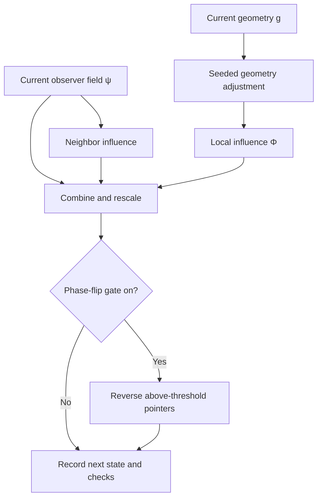

# QOFT Lab: A Visual Guide to What You’re Seeing

**A hands-on guide. No mathematics required.**

[Open QOFT Lab](https://donaldtuttle.github.io/qoft-lab/) · [Repository](https://github.com/donaldtuttle/qoft-lab)

QOFT Lab lets you watch a small simulated world change, adjust the rules, and compare what happens. Each square contains a local geometric shape and an observer-field value, drawn as an ellipse and a small pointer. The program repeatedly updates these values and records checks on its own behavior. **(Typed Realization · ρ̂_conf_HIGH)**

The question to keep in mind is: **Which rule caused the change I’m seeing?**

> This guide describes the repository’s v0.1.2 implementation at commit `8ada5c1bdd0071404bbfe4457842594636b02b07`. “Toy” means a deliberately simplified model. Its status is **DEVELOP**, with **no canonical weight**: it is an experimental implementation, not an amendment to QOFT. **(ρ̂_conf_HIGH)**

Confidence labels mark source-supported claims: `ρ̂_conf_HIGH` means directly supported by the inspected code or documentation; `ρ̂_conf_MED` means a reasonable interpretation. They do not rate QOFT as a whole.

## 1. Start here: your first two minutes

1. Open the Lab and select **Load v0 defaults**. This gives you an 8×8 grid, seed 7, and the phase-flip gate switched off.
2. Select **Observer ψ** to focus on the pointers.
3. Press **Step** a few times. Each press advances the calculation once.
4. Select **Composite** to see the ellipses alongside the pointers.
5. Click or tap a cell to pin its numbers in the **Site** panel.
6. Press **Toy run · 32 ticks** to run a fresh, repeatable check from the current settings.

These controls and starting values are present in the inspected implementation. Toy run starts again from the configured seed; it does not merely add 32 steps to your current scene. **(ρ̂_conf_HIGH)**

On a wide screen, controls sit on the left, the field in the middle, and checks on the right. On a narrow screen, those sections stack. The telemetry chart appears below. **(ρ̂_conf_HIGH)**

## 2. Read the picture

Think of the display as a map with several measurement overlays. This is a viewing analogy, not a claim that the model describes a physical landscape.

| What you see | What it means in this Lab |
| --- | --- |
| **Square grid** | The locations where the program stores values. Neighbor calculations wrap across the edges: the left and right edges connect, as do the top and bottom. **(ρ̂_conf_HIGH)** |
| **Small pointer** | The local value of **ψ**, the observer field. Its direction shows **phase**; its length shows relative magnitude. Think “clock hand” for direction. **(ρ̂_conf_HIGH)** |
| **Ellipse** | The local **metric g**, a mathematical rule for measuring directions and lengths. Its shape and orientation visualize that rule. **(ρ̂_conf_HIGH)** |
| **Brighter observer shading** | Greater local magnitude relative to the strongest cell in that frame. **(ρ̂_conf_HIGH)** |
| **Warm threshold outline** | The cell’s concentration score is above the gate’s threshold. In Composite, Metric, and Observer views, the outline is dashed with the gate off and solid with it on. **(ρ̂_conf_HIGH)** |
| **Pinned cell outline** | Your selected location for inspection. This selection does not change the simulation. **(ρ̂_conf_HIGH)** |

**A pointer is not a particle’s direction of travel.** It represents the angle of a stored mathematical value. The ellipses likewise visualize stored geometry; they are not photographs of objects. **(ρ̂_conf_HIGH)**

The observer display rescales pointer lengths and brightness against the current frame’s maximum. Pullback shading also rescales to the current range. A scene can retain strong visual contrast while its underlying numbers change, so use the Site panel or chart for comparisons over time. **(ρ̂_conf_HIGH)**

## 3. What each layer reveals

Changing layers changes the view, while preserving the simulation state. **(ρ̂_conf_HIGH)**

| Layer | Look for |
| --- | --- |
| **Composite** | Pointers, ellipses, shading, and threshold outlines together. Useful after learning the individual parts. **(ρ̂_conf_HIGH)** |
| **Observer ψ** | Pointer directions and relative strengths. This is the clearest place to watch a phase reversal. **(ρ̂_conf_HIGH)** |
| **Metric ι** | Ellipse shape and orientation. The background still includes observer/concentration shading; this is not a geometry-only heatmap. **(ρ̂_conf_HIGH)** |
| **Fiber RGB** | Three stored geometry components mapped into red, green, and blue. These colors encode numbers, not emitted light or extra physical dimensions. **(ρ̂_conf_HIGH)** |
| **Collapse C** | Local concentration relative to the field average, with above-threshold cells highlighted. The legacy name does not mean physical collapse has occurred. **(ρ̂_conf_HIGH)** |
| **Pullback Φ** | A scalar value calculated from the geometry at each location. This value supplies the geometry’s influence on ψ through β. **(ρ̂_conf_HIGH)** |

“Fiber” here means the collection of geometry values attached to a location. “Pullback” means evaluating a geometry-dependent quantity at the geometry currently assigned to that location. These are translations of this toy’s construction. **(ρ̂_conf_HIGH)**

## 4. What happens in one tick?

One **tick** is one update cycle. The code makes a small seeded random adjustment to the geometry, calculates its local influence, updates ψ using its neighbors and that influence, rescales ψ to an overall magnitude near one, and then applies the optional phase flip. **(ρ̂_conf_HIGH)**

This diagram follows the toy’s update dependencies. Geometry can influence ψ, but ψ does not feed back into the geometry update in this version. **(ρ̂_conf_HIGH)**

## 5. What is a phase-flip gate?

Imagine one pointer facing three o’clock. A phase flip makes it face nine o’clock **without changing its length**. In the code, this is multiplication by −1. Applied twice to the same value with nothing else happening between, it restores the original value. **(ρ̂_conf_HIGH)**

| Immediately before the flip | Immediately after the flip |
| --- | --- |
| Pointer faces one direction | Pointer faces the opposite direction |
| A particular magnitude | The same magnitude |
| A particular concentration score C | The same concentration score C |

All three relationships describe the isolated flip, not an entire tick, which also contains other updates. **(ρ̂_conf_HIGH)**

The **gate** decides where to do this. It compares each cell’s squared magnitude with the average squared magnitude across the grid. A score **C ≈ 1** is approximately average; **C ≈ 2** is approximately twice average. The toy flips cells when **C > 1.67**. That threshold is a local design choice. **(ρ̂_conf_HIGH)**

Why can reversing a pointer matter later? The next update combines neighboring values. Their relative directions affect the result, so a local reversal can change later strengths and patterns even though it leaves strength unchanged at the moment of the flip. **(ρ̂_conf_HIGH)**

**The phase flip is an experimental intervention, not an implementation of canonical Λψ.** The repository explicitly distinguishes its reversible sign change from a commitment-like or collapse-like projection. The words “Collapse C” and the CSV field `collapsed` are retained interface names. **(ρ̂_conf_HIGH)**

## 6. Try a fair comparison

### Experiment A: gate off versus gate on

1. Select **Load v0 defaults**.
2. Run **Toy run · 32 ticks** with the gate off.
3. Inspect Observer ψ and the chart; save the **CSV** if you want a record.
4. Turn the **Phase-flip gate** on, keeping the other settings unchanged.
5. Run **Toy run · 32 ticks** again and save that CSV.
6. Compare the same tick in both runs, rather than comparing different playback times.

Each Toy run reconstructs the initial state from the seed. This makes the gate the changed condition in the procedure above. The seeded geometry evolution is unaffected by that switch. **(ρ̂_conf_HIGH)**

Look for changes in pointer directions, the concentration trace, and neighbor disagreement. Differences are not guaranteed in every measurement: if no cell activates the gate, that run has not exercised the intervention. **(ρ̂_conf_HIGH)**

For an especially clear visual comparison, use two browser tabs with v0 defaults, enable the gate in only one, and press **Step** once in each. On the first step, the gate alone preserves each cell’s magnitude while reversing any qualifying pointer. Compare the numeric Site values as well as the picture. **(ρ̂_conf_HIGH)**

### Experiment B: isolate the influences

Use a fresh reset for each comparison, leaving the seed and grid unchanged.

| Change | What the code isolates |
| --- | --- |
| **α = 0** | Removes direct neighbor mixing from the ψ update. **(ρ̂_conf_HIGH)** |
| **β = 0** | Removes geometry’s pullback contribution to the ψ update. Geometry can still change visibly. **(ρ̂_conf_HIGH)** |
| **ε = 0** | Freezes geometry evolution at its initialized values. Those values can still influence ψ if β is nonzero. **(ρ̂_conf_HIGH)** |
| **α = 0, β = 0, gate off** | Leaves only the repeated rescaling of ψ; the observer pattern should remain effectively unchanged apart from numerical precision. Geometry can still evolve if ε is nonzero. **(ρ̂_conf_HIGH)** |

These comparisons ask a practical question: does removing a rule remove its expected influence? A reproducible disagreement with these code-level expectations would warrant investigating the implementation or the comparison procedure.

## 7. Controls without the jargon

| Control | Meaning |
| --- | --- |
| **Play / Pause** | Start or stop repeated updates. **(ρ̂_conf_HIGH)** |
| **Step** | Pause playback and advance once. **(ρ̂_conf_HIGH)** |
| **Reset** | Recreate the starting state using the current settings; clear recorded history. **(ρ̂_conf_HIGH)** |
| **Toy run · 32 ticks** | Run a fresh 32-step experiment and repeat it internally to check reproducibility. **(ρ̂_conf_HIGH)** |
| **Speed** | Requested updates per second, not a different mathematical update rule. **(ρ̂_conf_HIGH)** |
| **Seed** | Chooses a repeatable initialization and random sequence. Changing it resets the simulation. **(ρ̂_conf_HIGH)** |
| **Grid** | Chooses 8, 16, 24, or 32 cells per side. Changing it resets the simulation. **(ρ̂_conf_HIGH)** |
| **α fusion** | Strength of neighbor mixing in this toy; it does not control every part of canonical fusion. **(ρ̂_conf_HIGH)** |
| **β pullback** | Strength of geometry’s contribution to the observer update. **(ρ̂_conf_HIGH)** |
| **ε metric** | Size of proposed random geometry adjustments. **(ρ̂_conf_HIGH)** |
| **CSV** | Download the currently retained numerical history. **(ρ̂_conf_HIGH)** |

α, β, ε, and the gate can change during a run without resetting it. That is useful for exploration; use fresh Toy runs when comparing fixed conditions. Ordinary playback retains the latest **256 rows**, and CSV exports that retained history. Record settings separately, especially after changing them mid-run. **(ρ̂_conf_HIGH)**

## 8. Read the chart and numbers

| Readout | Plain-language interpretation |
| --- | --- |
| **‖ψ‖** | Overall field magnitude. The update explicitly keeps it near 1; a steady reading is partly a consequence of that rule. **(ρ̂_conf_HIGH)** |
| **C_max** | The highest relative concentration anywhere on the grid. **(ρ̂_conf_HIGH)** |
| **C > λc** | Number of cells currently above the threshold, whether or not the gate is enabled. **(ρ̂_conf_HIGH)** |
| **det g min** | The smallest geometry determinant across the grid, used in the geometry validity check. **(ρ̂_conf_HIGH)** |
| **⟨Φ_X⟩** | Average geometry-derived influence across the grid. **(ρ̂_conf_HIGH)** |
| **‖Γnbr‖** | Overall difference between cells and their neighbor averages, including phase differences. It measures the neighbor term, not the full Γtoy update. **(ρ̂_conf_HIGH)** |
| **Site: arg ψ** | The selected pointer’s angle, reported in radians. **(ρ̂_conf_HIGH)** |
| **CSV: collapsed** | 1 if at least one cell was flipped in that tick, otherwise 0. It is not a count of flipped cells. **(ρ̂_conf_HIGH)** |

Toggle chart series to inspect them individually. They share a vertical axis despite representing different quantities; equal graph heights do not mean equivalent physical effects. The chart’s first recorded update is labeled `t = 0`, while the main counter shows one completed tick. **(ρ̂_conf_HIGH)**

Older CSV names `gammaNorm` and `reflexNorm` are aliases of `gammaNbrNorm`; they are not additional independent measurements. **(ρ̂_conf_HIGH)**

## 9. What does PASS mean?

**PASS means the run satisfied the particular software checks below.** It does not establish that QOFT describes nature. **(ρ̂_conf_HIGH)**

| Check | Everyday translation |
| --- | --- |
| **P1 — section law** | Each location remains paired with the correct geometry storage slot, with complete unique coverage and finite geometry values. **(ρ̂_conf_HIGH)** |
| **P2 — det g > 0** | Recorded geometry determinants stay positive. **(ρ̂_conf_HIGH)** |
| **P3 — fiber = 3** | The two-dimensional symmetric geometry uses three independent components. **(ρ̂_conf_HIGH)** |
| **P4 — C = f(ψ) only** | The concentration calculation is isolated to ψ under the implemented checks. This is not an exhaustive audit of every theoretical boundary. **(ρ̂_conf_HIGH)** |
| **P5 — deterministic** | Two fresh runs with the same settings produce identical recorded telemetry in this engine. **(ρ̂_conf_HIGH)** |
| **P6 — phase-flip off** | When the gate is disabled for the run, no flips are recorded. **(ρ̂_conf_HIGH)** |

A dash means a live check is pending, not necessarily failing. P5 needs the repeated Toy run. P6 is conditional: a Toy run with the gate on can display PASS without testing the gate-off condition. **(ρ̂_conf_HIGH)**

## 10. Where QOFT enters the picture

The framework’s update relationship is:

**Ξ(ψ) = ψᴽ ⊕ Γ(ψ; ctx)**

Read it as: **construct a self-model of the current state, combine it with a context-dependent update, and produce the next state.** This translates the stated QOFT contract, rather than asserting an experimentally established law of nature. **(QOFT Canon as documented · ρ̂_conf_HIGH)**

| Symbol | Role | What this toy actually does |
| --- | --- | --- |
| **ψ** | Current observer state | Stores a magnitude and phase at each cell. **(ρ̂_conf_HIGH)** |
| **Πᴽ → ψᴽ** | Constructs the reflexive self-model | Copies the current ψ unchanged. It has no nontrivial self-model or memory dependence. **(ρ̂_conf_HIGH)** |
| **Γ** | Produces the contextual update | Combines neighbor differences with the geometry-derived contribution. **(ρ̂_conf_HIGH)** |
| **⊕** | Fuses the two differently typed inputs | Uses internal addition followed by rescaling in this particular representation. **(ρ̂_conf_HIGH)** |
| **Ξ** | Produces the next state | Executes that toy update. **(ρ̂_conf_HIGH)** |

The external contract remains **⊕ : Ψᴽ × G → Ψ**. This toy’s arithmetic does not define every possible fusion mechanism. The interface’s `Π*toy` shorthand refers to its declared identity implementation; the framework notation retained here is **Πᴽ**. **(ρ̂_conf_HIGH)**

“Observer” names a field in the model. This implementation contains no mechanism establishing that the field perceives, understands, or has conscious experience. **(ρ̂_conf_HIGH)**

## 11. What did this project accomplish?

The repository provides an inspectable implementation of a small, explicitly declared QOFT update, with visible controls, repeatable runs, and checks on selected implementation rules. That makes concrete behavior available for examination. **(Typed Realization · ρ̂_conf_HIGH)**

Its practical value is that disagreements can become specific: which update ran, which assumption was used, which control changed the outcome, and which check would catch an error? That is a useful step from an abstract proposal toward a testable research program. **(Interpretation · ρ̂_conf_MED)**

The visible patterns already have an ordinary computational explanation: neighbor mixing, geometry-dependent weighting, normalization, seeded geometry changes, and optional sign reversals. A stronger scientific claim would need predictions and comparisons that establish additional explanatory value beyond those ingredients. **(ρ̂_conf_HIGH)**

The Lab does not by itself establish physical quantum behavior, consciousness, canonical collapse, or a unification of QOFT with Geometric Unity. Its GU terminology is explicitly an analogy, and its code omits the full machinery of that theory. **(ρ̂_conf_HIGH)**

These limits leave room for further exploration. A proposed extension can add richer self-modeling, memory, different fusion rules, or new physical hypotheses, provided its new assumptions and tests are stated separately. Success in this toy would not automatically transfer to that extension. **(Research interpretation · ρ̂_conf_MED)**

## Source and verification notes

This guide was checked against source code and documentation at the pinned commit below. It does not report a new runtime test or a fresh visual inspection of either deployed host. The separately hosted Grok app is not assumed to match the GitHub build. The complete D-Π-01 eight-file corpus was not available for a full canon audit; framework references here follow the stated project contract and the repository’s declared crosswalk.

- [Drawing rules: pointers, ellipses, colors, outlines](https://github.com/donaldtuttle/qoft-lab/blob/8ada5c1bdd0071404bbfe4457842594636b02b07/src/components/lab/field-canvas.tsx)
- [Controls](https://github.com/donaldtuttle/qoft-lab/blob/8ada5c1bdd0071404bbfe4457842594636b02b07/src/components/lab/control-panel.tsx)
- [Playback, resets, retained history, and exports](https://github.com/donaldtuttle/qoft-lab/blob/8ada5c1bdd0071404bbfe4457842594636b02b07/src/stores/lab-store.ts)
- [Simulation, phase flip, and P1–P6 checks](https://github.com/donaldtuttle/qoft-lab/blob/8ada5c1bdd0071404bbfe4457842594636b02b07/src/lib/qoft/sim.ts)
- [Live check display](https://github.com/donaldtuttle/qoft-lab/blob/8ada5c1bdd0071404bbfe4457842594636b02b07/src/components/lab/invariant-rail.tsx)
- [Chart series](https://github.com/donaldtuttle/qoft-lab/blob/8ada5c1bdd0071404bbfe4457842594636b02b07/src/components/lab/telemetry-chart.tsx)
- [Layout and formula bar](https://github.com/donaldtuttle/qoft-lab/blob/8ada5c1bdd0071404bbfe4457842594636b02b07/src/components/lab/lab-app.tsx)
- [Typed realization and its limits](https://github.com/donaldtuttle/qoft-lab/blob/8ada5c1bdd0071404bbfe4457842594636b02b07/docs/TYPED_REALIZATION.md)

Suggested repository location: `docs/VISUAL_GUIDE.md`.
